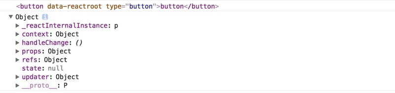

### ref简介
`React`提供的这个`ref`属性，表示为对组件真正实例的引用，其实就是`ReactDOM.render()`返回的组件实例；需要区分一下，`ReactDOM.render()`渲染组件时返回的是组件实例；而渲染`dom`元素时，返回是具体的`dom`节点。

例如，下面代码:
```
		//dom元素
	  const domCom = <button type="button">button</button>;
	  const refDom = ReactDOM.render(domCom，container);


		 //组件    ConfirmPass的组件内容省略
	  const refCom = ReactDOM.render(<ConfirmPass/>,container);


	  console.log(refDom);
	  console.log(refCom);
```

控制台会打印出:


### ref可以设置回调函数
ref属性可以设置为一个回调函数，这也是官方强烈推荐的用法；这个函数执行的时机为：


**组件被挂载后**，回调函数被立即执行，回调函数的参数为该组件的具体实例。

**组件被卸载或者原有的ref属性本身发生变化时**，回调也会被立即执行，此时回调函数参数为null，以确保内存泄露。

例如下面代码：

```
	
	RegisterStepTwo = React.createClass({
	    getInitialState(){
	      return {visible: true};
	    },
	  changeVisible(){
	    this.setState({visible: !this.state.visible});
	  },
	  refCb(instance){
	    console.log(instance);
	  },
	  render(){
	    return(
	      <div>
	        <button type="button" onClick={this.changeVisible}>{this.state.visible ? '卸载' : '挂载'}ConfirmPass
	        </button>
	        {
	          this.state.visible ?
	            <ConfirmPass ref={this.refCb} onChange={this.handleChange}/>: null
	         }
	       </div>
	     )
	  }
	});
```


### ref可以设置字符串

ref还可以设置为字符串值，而不是回调函数；这种方式基本不推荐使用，或者在未来的react版本中不会再支持该方式，但是可以了解一下。

例如下面input设置ref的值为字符串

`<input ref="input" />`

然后在其他地方如事件回调中通过`this.refs.input`可以访问到该组件实例，其实就是dom元素节点。

```let inputEl = this.refs.input;
//然后通过inputEl来完成后续的逻辑，如focus、获取其值等等
```

### 获取ref引用组件对应的dom节点

不管ref设置值是回调函数还是字符串，都可以通过`ReactDOM.findDOMNode(ref)`来获取组件挂载后真正的dom节点。

但是对于html元素使用ref的情况，ref本身引用的就是该元素的实际dom节点，无需使用`ReactDOM.findDOMNode(ref)`来获取，该方法常用于React组件上的ref。


### ref在有状态组件中的使用

上文说到过ref用到react有状态组件时，ref引用的是组件的实例；所以可以通过子组件的ref可以访问到子组件实例的props、state、refs、实例方法(非继承而来的方法)等等。

使用ref访问子组件情况可能是以下case：

 * 访问子组件的某个具体的dom节点完成某些逻辑，通过`this.refs.childComponentRefName.refs.someDomRefName`来完成。

* 可以访问子组件的公共实例方法完成某写逻辑。例如子组件定义了一个reset方法用来重置子组件表单元素值，这时父组件可以通过this.refs.childComponentRefName.reset()来完成子组件表单元素的重置。

* ...

不过话说回来，react不建议在父组件中直接访问子组件的实例方法来完成某些逻辑，在大部分情况下请使用标准的react数据流的方式来代替则更为清晰；

另外，上述case在组件关系嵌套很深时，这种方式就显得极为丑陋。

### ref在无状态组件中的使用

上文说到的react组件都是指有状态的，对于无状态组件stateless component而言，正如这篇文章React创建组件的三种方式及其区别里描述的一样，无状态组件是不会被实例化的，在父组件中通过ref来获取无状态子组件时，其值为null，所以：

* 无法通过ref来获取无状态组件实例。

虽然无法通过ref获取无状态组件实例，但是可以结合复合组件来包装无状态组件来在其上使用ref引用。

另外，对于无状态组件我们想访问的无非是其中包含的组件或者dom元素，我们可以通过一个变量来保存我们想要的组件或者dom元素组件的实例引用。例如下面代码：

```function TestComp(props){
    let refDom;
    return (<div>
        <div ref={(node) => refDom = node}>
            ...
        </div>
    </div>)
}
```

这样，可以通过变量refDom来访问到无状态组件中的指定dom元素了，访问其中的其他组件实例类似。

最后补充一点：

* 不要在组件的render方法中访问ref引用，render方法只是返回一个虚拟dom，这时组件不一定挂载到dom中或者render返回的虚拟dom不一定会更新到dom中。