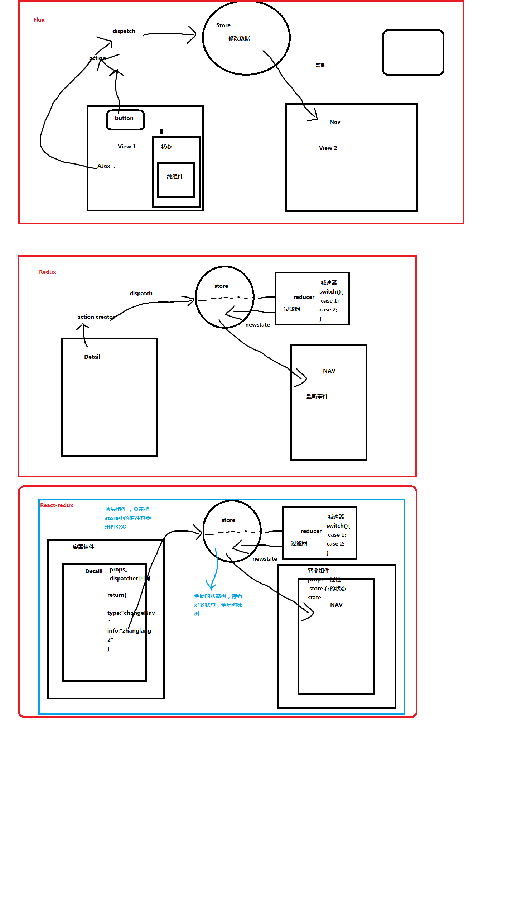

### redux 与 react-redux

**redux是用来创建store的**

**react-redux是用给每个组件引入connect,以及在router.js里引入的**

**reduer跟他们两个都没关系，只是用来执行更新数据的。**

------


 先来看数据流向图:




解释:在redux里，store是不能修改的，你只能增加新的state，才可以。

### redux的设计思想

Redux 的设计思想很简单，就两句话。

>（1）Web 应用是一个状态机，视图与状态是一一对应的。

>（2）所有的状态，保存在一个对象里面。

#### api

**1. store**
  
  store是保存数据的地方，一个完整的应用只能有一个store。

redux提供`createStore`来生成store对象。
```
	import {createStore} from 'redux'

	const = createStore(fn);
```
  
  上面代码中，`createStore`函数接受另一个函数作为参数，返回新生成的 Store 对象。

 这个函数就是下面要提到的reducer.
```
	import {createStore} from "redux";

	import reducer from "../Reducer";
	const store = createStore(reducer);


	export default store;
```

**2. state**

  state对象包含所有数据的。如果想得到某个时点的数据，就要对 store 生成快照。这种时点的数据集合，就叫做 state。

  此刻的store，可以通过store.getState()拿到。

```
	import { createStore } from 'redux';
	const store = createStore(fn);

	const state = store.getState();
```
react规定，一个state对应一个view。只要 State 相同，View 就相同。你知道 State，就知道 View 是什么样，反之亦然。

**3. action**

  state的变化会导致view的变化，但是用户只能接触view，接触不到state。所以state的变化必须是要view的变化导致的。`action`就是view发出的通知，表示state要变化了。

  action是一个对象，其中type的属性是必须的，表示action的名称。其他属性自由设置。下面是规范的写法。

```
	const action = {
	  type: 'ADD_TODO',
	  payload: 'Learn Redux'
	};
```

上面表示，`ADD_TODO`是action的名称,携带字符串`learn Redux`。

**其实，这个action就是要被传入reducer的，然后，reducer也是被传入createStore的。**

所以:view变化---->发出action--->传到store--->传到reducer,生成新的action--->state变化

**4. action Greator**
  
  View 要发送多少种消息，就会有多少种 Action。如果都手写，会很麻烦。可以定义一个函数来生成 Action，这个函数就叫 Action Greator。

```
	const ADD_TODO = '添加 TODO';

	function addTodo(text) {
	  return {
	    type: ADD_TODO,
	    text
	  }
	}

	const action = addTodo('Learn Redux');
```

上面的`addTodo`就是一个action Greator。

**5. store.dispatch()**

  store.dispatch()是view发出action的唯一办法。

```
	import { createStore } from 'redux';
	const store = createStore(fn);

	store.dispatch({
	  type: 'ADD_TODO',
	  payload: 'Learn Redux'
	});
```

上面的store接受一个action对象作为参数，将它发送出去。

结合 Action Creator，这段代码可以改写如下。

```
	store.dispatch(addTodo(text));
```

**6. Reducer**

store收到action以后，必须给出一个新的state，这样view才会发生变化。这种计算过程就是Reducer。

Reducer是一个函数。它接收两个参数，一个是当前的state对象，一个是action。返回一个新的state。

```
	const reducer = (state,action)=>{
			...
			return new_state
	}
```

整个应用的初始状态可以作为state的初始值。

```
	const defaultState = 0;

	const reducer = (state = defaultState,action)=>{
			switch (action.type) {
				case 'ADD':
					return state+action.payload;
				default:
				  	return state;
			}
	}


```

上面代码中，reducer函数收到名为ADD的 Action 以后，就返回一个新的 State，作为加法的计算结果。其他运算的逻辑（比如减法），也可以根据 Action 的不同来实现。

实际开发中，不可能这样写。只要将reducer作为参数传入createStore,就可以将他俩绑在一起。

```
	import { createStore } from 'redux';
	const store = createStore(reducer);
```

这样，`store.dispatch()`会自动触发`reducer`。

**7. 纯函数**

  纯函数就是输入什么，就输出什么。格式，属性名都不会变化，变化的只能是属性值。

  **而reducer就是纯函数。**

  由于 Reducer 是纯函数，就可以保证同样的State，必定得到同样的 View。但也正因为这一点，Reducer 函数里面不能改变 State，必须返回一个全新的对象，请参考下面的写法。

```
	//---state是对象
	const reducer = (state,action)=>{
		return Object.assign({},state,{ thingToChange });
		// 或者
		return {...state,...newState};
	}

	//---state是数组
	const reducer = (state,action)=>{
		return [...state,...newState];
	}
```

最好把 State 对象设成只读。你没法改变它，要得到新的 State，唯一办法就是生成一个新对象。这样的好处是，任何时候，与某个 View 对应的 State 总是一个不变的对象。

**8. store.subscribe()**

subscribe的英文意思是:订阅。

store允许使用store.subscribe()方法设置监听函数，一旦state发生变化，就自动执行这个函数。

```
	import { createStore } from 'redux'

	const store = createStore(reducer);
	
    const Func = ()=>{console.log('state发生变化了，快跑啊')};
	store.subscribe(Func);

```

显然只要把组件的`render`方法，或者`this.setState()`放入`store.subscribe()`,只要state一变化，就会重新渲染view。

store.subscribe()参数是一个函数，返回值也是一个函数，只要调用这个返回值函数，就是解除subscribe的监听。

```
	const unsubscribe = store.subscribe(()=>{console.log('我操你妈')});
		  unsubscribe();//解除subscribe监听。
```

---------

### store的实现

上面把redux的api介绍的差不多了。我们可以发现store提供了三个方法:

> store.getState()
> store.dispatch()
> store.subsscribe()

至于createStore()还可以接受第二个参数,表示state的初始状态。

```
	import { createStore } from 'redux'

	let {getState,dispatch,subscribe} = createStore(reducer,window.STATE_FROM_SERVER)
```

上面代码中，`window.STATE_FROM_SERVER`就是整个应用的初始状态值。如果提供了这个值，那么会覆盖reducer里的初始值。

createStore的内部结构，可以了解下store是怎么实现的。

```
 const createStore = (reducer)=>{
	let state;
	let listeners = [];
	
	//----获取当前的state
	const getState = () =>return state;
	
	//----更新state,并且执行subscribe的设置的监听函数
	const dispatch = (action) => {
		state = reducer(state,action);
		listeners.forEach(listener => listener());
	}

	//---设置监听函数
	const subscribe = (Func) =>{
		listerners.push(Func);
		return ()=>{
			listeners = listeners.filter(length => length !== listener);
		}
	}

	dispatch({});

	return {getState,dispatch,subscribe};
 }
```

--------

### reducer的拆分

我们可以把reducer没有相关性的方法分开来写。

例如:reducer.js

```
	import xixi from './xixi'
	import haha from './haha'

	const reducer = (state = defaultState,action) => {
		return {
			xixi:xixi(state.xixi,action)
			haha:haha(state.haha,action)
		}
	}
```

上面的代码中，reducer被拆分成了两个小函数，每个小函数只要负责自己的部分。

Redux提供了一个`combineReducers`方法用于reducer的拆分。只要定义各个子函数，然后再用这个`combineReducers`就可以将这些子函数整合为Reducer。

```
	import { combineReucers } from 'redux'

	const xixihahaReducer = combineReducers({
		xixi,
		haha
		})

	export default xixihahaReducer;

```

这样写的前提是state的属性名必须与子函数的方法名同名。如果不同名，只能写成下面这样的。

```
	const xixihahaReducer = combineReducers({
		wocao:xixi,
		nima:haha
		})

	//上面等同于下面这样:
	const xixihahaReducer = (state = defaultState , action) =>{
		return {
			wocao:xixi(state.wocao,action),
			nima:haha(state.nima,action)
		}
	}
```

总之，`combineReducers()`做的就是产生一个整体的`Reducer`函数。该函数根据 `State` 的 `key` 去执行相应的子 Reducer，并将返回结果合并成一个大的 `State` 对象。

 **combineReducers()的简单实现**

```
	const reducers = {xixi,haha}
	//-------reducers是对象。
	const combineReducers = (reducers) =>{
		return (state={},action)=>{
					return {
						Object.keys(reducers).reduce(
							(nextState,key) =>{
									nextState[key] = reducers[key](state[key],action);
									return nextState ;
								}
								//----下面的空对象会引用nextState
								,{}
							)
					}
		}	
	}
```
上面涉及到Object.keys(obj)与Array.prototype.reduce()。我们来扩展下:

Object.keys(obj):
  > 参数:可以是对象，数组，类数组。
  > 返回值:参数为对象，返回属性名;参数为数组，类数组，返回索引值。
 ```
		let xixi = {wo:'aaa',cao:'bbb'};
		let haha = ['aa','bb','cc'];

		console.log(Object.keys(xixi));
		//---['wo','cao'];
		
		console.log(Object.keys(haha));
		//---['0','1','2'];
 ```

Array.prototype.reduce():
 > 参数：
 		两个参数，第一个参数为回调函数callback(sum,ele)，回调函数也有两个参数，第一个值为上一个的返回值，ele为当前遍历到的成员。第二个参数为自己定义的初始sum，可选。
 		第二个参数不写，reduce会执行length-1次，callback的sum的初始值就是第一个ele，而reduce会从第二个ele开始执行。
 		第二个参数写，reduce就会执行length次，reduce从第一个ele开始执行。
 > 返回值:最终的sum

```
	let arr = [1,2,3];
	let arr2 = arr.reduce((sum,ele)=>{
		//--执行两次
		console.log('sum:'+sum,'ele:'+ele);
		//---下面的返回值作为下一次的运行的sum
		return sum+ele;
	})
	let arr3 = arr.reduce((sum,ele)=>{
		//--执行三次
		console.log('sum:'+sum,'ele:'+ele);
		//---下面的返回值作为下一次的运行的sum
		return sum+ele;
	},0)
	console.log(arr2);
	console.log(arr3);
```

可以把所有的子reudcers放到同一个文件里，然后一起导入到reducer文件中

```
	import { combineReducers } from 'react'
	import * as childReducers from './childReducers'

	const reducer = combineReducers(childReducers);
```

------

### 工作流程


1. 首先用户发出action,执行store.dispatch(action).
2. store自动执行reducer,并且传入两个参数:当前state和收到的action。Reducer会返回新的state。
3. state一旦有了变化就会触发监听函数。
```
	//-设置当前监听函数
	store.subscribe(listener)
```
	`listener`可以通过store.getState()得到当前状态，在react里可以这样使用:
```
	function listener(){
		let newState = store.getState();
		component.setState(newState);
	}
```

